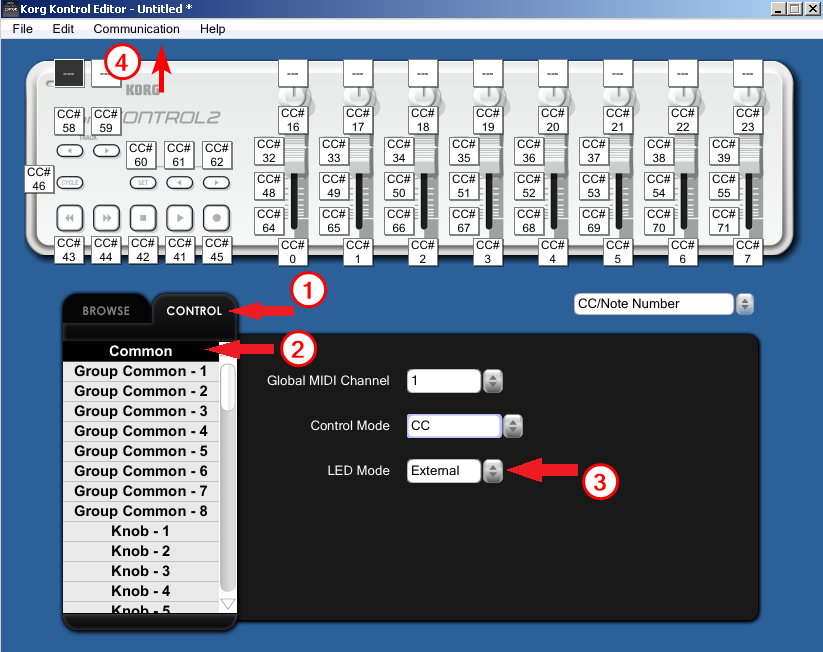

# ❓ FAQ

## My device / MIDI Mixer isn't working! 

Make sure that **only** MIDI Mixer is using your device. If you have another program open that can use or make changes to your device, try closing it.

Another easy solution could be unplugging and replugging your device from your computer. Or maybe it's possible to reset your specific device to factory settings.

[Try and uninstall your device drivers and then re-install them.](faq.md#how-do-i-uninstall-and-re-install-drivers)

If that doesn't work, then check if your device needs specific drivers to function. You can usually find those on the official website for your device. If you already have those specific drivers, then also try and uninstall and then re-install them.

Even a computer restart could be the simple fix that's needed. And in rare cases, trying another computer port or another cable might fix the issue.

If all fails, let us know in on the [Discord server](https://discord.midi-mixer.com/) in `#support`, and we'll try to help you get it working.

It's most helpful if you start by telling us the steps you've already tried to resolve the issue, and which device you have.

**If you don't tell us what you've tried or which device you have, we might assume that you haven't checked the FAQ yet and ask you to look at that first.**

## How do I uninstall and re-install drivers?

1. Right-click the Windows icon in the bottom left of your screen.

2. Select Device Manager.

3. Select Sounds, video & game controllers.

4. Right-click on your device's name.

5. Select Properties.

6. Go to the Driver tab.

7. Select Uninstall Device.

Afterwards, re-install the drivers.

## Behringer X-TOUCH MINI not working?

#### Make sure it is in MC Mode!

1. Unplug the cable from the XTM and locate the **MC button** in the lower left of the panel.

2. Keep that button pressed while you plug the cable back in and the XTM turns on. 

All the buttons will flash twice and you'll know that it's in MC mode from the small light that will appear in the top right of the panel, right above the text, **MC MODE**.

## KORG nanoKONTROL2 not working?

If it's the lights that aren't working, then look [here instead](faq.md#how-do-i-get-the-lights-working-on-the-korg-nanokontrol-2).

First things first - Make sure you don't have other programs using your device, while you're trying to use MIDI Mixer with it. 

If you have the Korg Editor open, MIDI Mixer will not work.

#### Try resetting it!

1. Unplug the device.

2. Hold down the PREV. and NEXT buttons **and** the CYCLE button, and plug the cable back into the device, while holding the 3 buttons down.

3. Once you see the bottom lights flashing, you can let go of the buttons. Your device has now been reset!

A visual guide can also be found in [this YouTube video](https://youtu.be/zCvaq0J-xuU?t=23).

#### Resetting didn't work? 

[Try uninstalling and re-installing the drivers](faq.md#how-do-i-uninstall-and-re-install-drivers).

#### Still no luck? Try using the Korg Driver Uninstaller

It's part of the KORG USB-MIDI Driver Tools download at the bottom of [this page](https://www.korg.com/us/support/download/driver/1/285/3541/).

## How do I get the lights working on the Korg nanoKONTROL 2?

1. You can find the KORG KONTROL Editor, at the bottom of [this page](https://www.korg.com/us/support/download/product/0/159/), just above the drivers section where it says **Software**.

2. Make sure nothing else is using your device, **including MIDI Mixer!** Don't have it running while you're using the Editor.

3. In KORG KONTROL Editor, click **Common** found right under **CONTROL** and then under **LED Mode** set it to **External** instead of Internal. 

4. At the top of the screen, click **Communication** and then select **Write Scene Data**.

5. Make sure you **close** the Editor once you're done, so that the program is no longer running, otherwise MIDI Mixer will not work!

