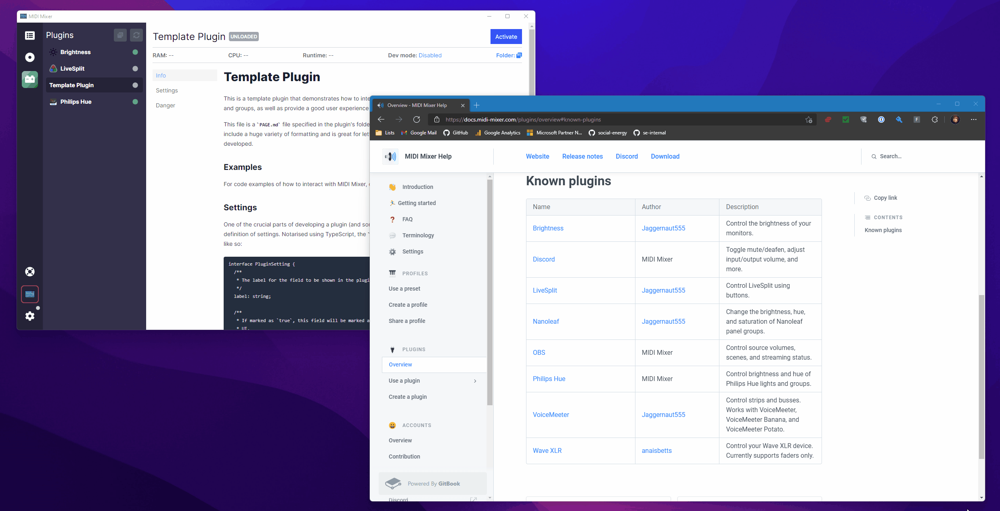

# Use a plugin

## Installation

A list of plugins is currently available on the [Plugins Overview](overview.md#known-plugins) page.

1. Select the plugin you'd like
2. Go to the "Releases" page\
   .png>)
3. Download the latest `.midiMixerPlugin` file\
   .png>)
4. Run the `.midiMixerPlugin` file
5. Refresh your plugins list



## Manual installation

Plugins are registered by extracting their built files in to `%appdata%/midi-mixer-app/plugins`. While a `.midiMixerPlugin` file will manage this process automatically, you can also manually install a plugin to this location.


If you're using the Windows Store version of MIDI Mixer instead of the standalone version and this path doesn't exist, try the following instead:

`%localappdata%\Packages\60992MIDIMixer.MIDIMixer_crf4gtfkaz836\LocalCache\Roaming\midi-mixer-app\plugins`


The most important detail is that a `plugin.json` file is in the root of the extracted plugin.

For example, an extracted plugin named `com.midi-mixer.discord` would have the following file tree:

```
midi-mixer-app/
├─ plugins/
│  ├─ com.midi-mixer.discord/
│  │  ├─ plugin.json
│  │  ├─ ...other files...
```

Once you've extracted the files, head in to the plugins UI and hit the refresh button to see your new plugin!

.png>)

If you don't see your plugin after hitting the refresh button or you're having other issues, check the [troubleshooting ](troubleshooting.md)guide.

